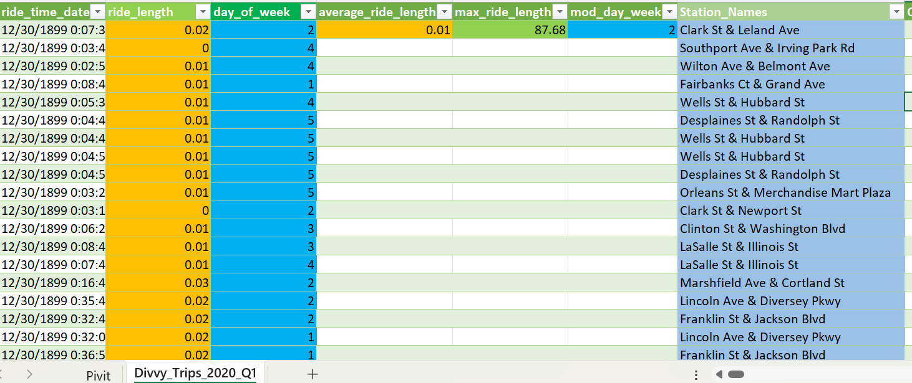
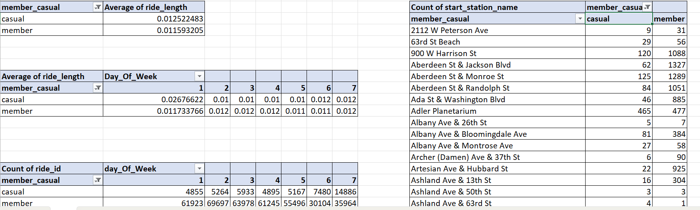

<h1>Case Study #1 -Divvy-Trip-2020🚎</h1>
<h1>Contents</h1>
<ul>
  <li><a href="#introduction">Introduction</a></li>
  <li><a href="#problemstatement">Problem Statement</a></li>
  <li><a href="#casestudyquestionsandsolutions">Case Study Questions & Solutions</a></li>
  <li><a href="#keyinsights">Key Insights</a></li>
</ul>
<h1><a name="introduction">Introduction</a></h1>

The Divvy trip data from 2020 offers a rich and publicly available dataset for analyzing the usage patterns of Chicago's bike-sharing system. As a crucial mode of urban transportation, Divvy bikes provide a sustainable and convenient alternative for commuters and casual riders alike. This dataset, which captures individual trips throughout the year, is an invaluable resource for data analysts, urban planners, and researchers seeking to understand how a bike-sharing service operates and evolves.

The year 2020 is particularly significant for analysis, as it encompasses the profound impact of the COVID-19 pandemic. The data reflects a period of unprecedented change in urban mobility, with shifting travel behaviors, changes in commuting habits, and the closure of public events. Analyzing this data can reveal how a major public transit system adapted to these challenges and how user types (annual members vs. casual riders) responded differently to the new circumstances.

<h1><a name="problemstatement">Problem Statement</a></h1>

The goal is to analyze the 2020 Divvy bike trip data to gain valuable insights into rider patterns, station usage, and trip durations. By understanding how Divvy bikes are used, stakeholders can make informed decisions about station placement, bike maintenance, and pricing strategies.

This case study uses three key datasets from the 2020 Divvy trip data:

Trip Data: Contains details about each ride, including start/end times, station locations, and rider type.

Station Data: Provides information about each Divvy station, such as its name and location.

Rider Data: Details about the different types of riders (e.g., casual vs. member).

<h1><a name="casestudyquestionsandsolutions">Case Study Questions & Solutions</a></h1>

<h1><a name="conductdescriptiveanalysis">Conduct Descriptive Analysis</a></h1>

<ol>
  <li><h5> Calculate the mean of ride_length?</h5></li>
  <li><h5> Calculate the max ride_length?</h5></li>
  <li><h5> Calculate the mode of day_of_week?</h5></li>
  <li><h5> Station Name?</h5></li>
  
<h6>Answer:</h6>

<ul>
  <li>The mean<code> ride_length:</code>by Excel Function: <code>=AVERAGE() </code> with the column containing your <code>ride_length data</code>.</li>
  <li>The max <code> ride_length:</code>by Excel Function: <code>=Max() </code> with the column containing your <code>ride_length data</code>.</li>
  <li>The mode <code> ride_length:</code>by Excel Function: <code>=MODE.SNGL() </code> with the column containing your <code>day_of_week</code>.</li>
</ul>

<h1><a name="pivittablefordeeperanalysis">PivotTable for Deeper Analysis</a></h1>

<ol>
  <li><h5> Calculate the mean of ride_length?</h5></li>
  <li><h5> Calculate the max ride_length?</h5></li>
  <li><h5> Calculate the mode of day_of_week?</h5></li>
  <li><h5> Station Name?</h5></li>
  
<h6>Answer:</h6>

<ul>
  <li>The average <code> ride_length</code> for members and casual riders:
PivotTable Setup:
Rows: <code>member_casual</code>
Values: <code>ride_length</code> (change the summary function to<code> Average</code>)
Now we easly calcuate the result</li>
<li>The average <code> ride_length</code> for users by<code> day_of_week</code>:
PivotTable Setup:
Columns:<code> day_of_week</code>
Rows: <code>member_casual</code>
Values: <code>ride_length</code> (change the summary function to<code> Average</code>)
Now we easly calcuate the result</li>
<li>The number of rides for users by <code> day_of_week</code>
PivotTable Setup:
Columns:<code> day_of_week</code>
Rows: <code>member_casual</code>
Values: <code>trip_id</code> (change the summary function to<code>Count</code>)
Now we easly calcuate the result</li>
</ul>

<h1><a name="keyinsights">Key Insights</a></h1>

<ul>
  <li>
    <h3>1. Differences in Trip Duration and Purpose</h3>
    <ul>
      <li>**Casual riders** take significantly longer trips on average than annual members. This suggests that casual riders are primarily using Divvy bikes for leisurely activities, sightseeing, or recreational purposes.</li>
      <li>**Annual members** have shorter, more consistent average ride lengths. This pattern is characteristic of daily commuters who use the bikes for quick trips, such as traveling to and from work or running errands.</li>
    </ul>
  </li>
  <li>
    <h3>2. Distinct Daily and Weekly Usage Patterns</h3>
    <ul>
      <li>**Annual members** show a strong preference for riding on weekdays, with usage peaking during standard commuting hours (morning and late afternoon). This reinforces the idea that members rely on the service for daily transportation.</li>
      <li>**Casual riders** have a higher volume of rides and longer average ride lengths on weekends (e.g., Saturday and Sunday). This weekend spike further supports the conclusion that casual riders are using the bikes for recreational activities when they have more free time.</li>
    </ul>
  </li>
  <li>
    <h3>3. Strategic Station Usage</h3>
    <ul>
      <li>**Annual members** likely utilize stations located in commercial districts, business centers, and near public transit hubs, where commuting is concentrated.</li>
      <li>**Casual riders** are more likely to start and end their trips in recreational areas, such as parks, lakefront paths, and tourist attractions. This information is crucial for optimizing bike and dock allocation.</li>
    </ul>
  </li>
  <li>
    <h3>4. The Impact of the 2020 Pandemic</h3>
    <ul>
      <li>The data from 2020, in particular, may show a shift in rider behavior due to COVID-19. With many people working from home, commuter trips by members may have decreased.</li>
      <li>Conversely, casual ridership likely increased as people sought safe, socially-distanced outdoor activities. This made the casual rider segment a more prominent and important part of the Divvy user base.</li>
    </ul>
  </li>
</ul>

<h1>Actionable Recommendations</h1>
<ul>
  <li>
    <h3>Targeted Marketing</h3>
    
The marketing team should focus on casual riders during their peak usage times and locations. For example, promoting weekend-specific or limited-time membership passes at stations near parks and popular weekend spots could be highly effective.

  </li>
  <li>
    <h3>Pricing Strategy</h3>
    
Create a new membership plan specifically for casual riders. This "leisure-focused" plan could offer benefits that align with their behavior, such as a lower monthly rate with a higher per-trip duration allowance or unlimited weekend rides.

  </li>
  <li>
    <h3>Operational Planning</h3>
    
Use the insights on station usage to improve bike redistribution. For example, ensure that popular recreational stations are well-stocked with bikes on weekend mornings to meet the high demand from casual riders.

